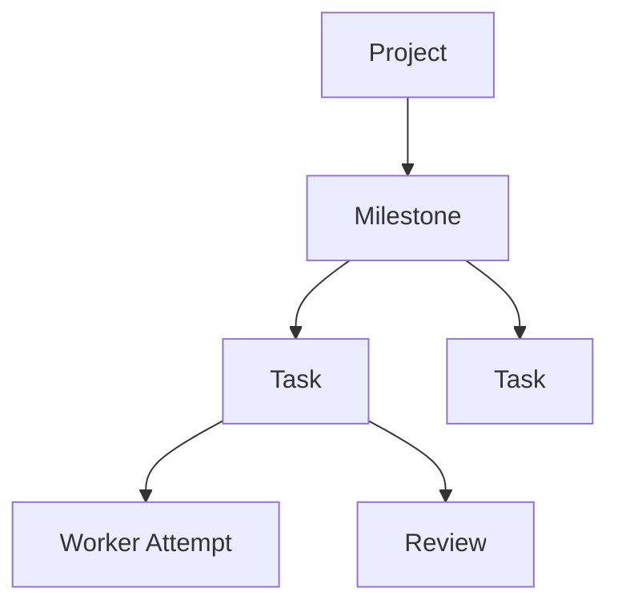
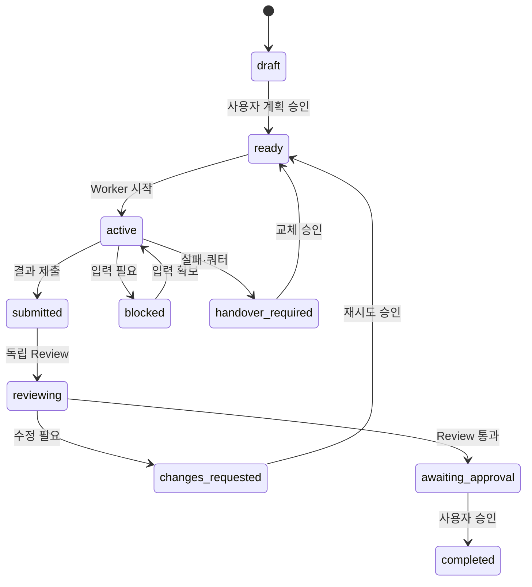

# Herdr Agent/Skills Harness Architecture

## 1. 목적

Herdr에서 Claude, Codex, AGY를 함께 사용하되 프로젝트마다 Controller 프로그램을 개발하지 않고 역할 문서, Agent Skills, Git, 사용자 승인으로 전체 작업 흐름을 운영합니다.

이 문서에서 Full Harness는 다음 흐름을 모두 다룬다는 의미입니다.

```text
Spec(자산 조사 + 인터뷰) → SPEC 승인 → Plan → Work(구현 + 자체 검증) → Review → User Approval → (실패 시 Handover)
```

무인 실행, 트랜잭션, 물리적 Sandbox를 의미하지는 않습니다.

핵심 실행 원칙은 "Bash는 한 스텝, Agent가 루프"입니다. `harness.sh`는 호출 한 번에 검증, 상태 전이 또는 Agent 한 턴만 수행합니다. Orchestrator Agent가 그 결과와 사용자 응답을 해석해 다음 명령을 선택하며, 상주 루프·자동 완료 승인은 수행하지 않습니다. `quota-retry`/`auto-step`(§8.1, §8.2)이 opt-in으로 유한한 자동화를 더하지만, 둘 다 호출 1회가 반드시 끝나는 배치이고 Provider 교체 후 재개나 `completed`는 여전히 사람이 승인합니다 — 상주 Controller나 무조건적 자동 failover는 아닙니다.

## 2. 구성요소

| 구성요소 | 책임 |
|---|---|
| Herdr | Workspace, Pane, Agent 프로세스와 상태 표시 |
| `harness.sh` 스텝 명령 | 정적 검증, 상태 전이 강제, Agent 한 턴 실행, Evidence와 런타임 관측 |
| `AGENTS.md` | Provider 공통 운영 정책 |
| `CLAUDE.md`, `GEMINI.md` | Provider별 짧은 진입 지침 |
| `.agents/roles/` | 역할·책임·금지사항 정본 |
| `.agents/skills/` | 재사용 가능한 실행 절차 |
| `.claude/skills/` | Claude가 공통 Skill을 읽기 위한 연결 |
| `.harness/` | SPEC, Wave, Task, Intent, Attempt, Evidence, Review, Handover, Decision, Runtime 상태 |
| 사용자 | SPEC, Wave, Failover, Integration, 완료 승인 |

## 3. 역할

| 역할 | 쓰기 | 책임 |
|---|---:|---|
| Interviewer | Harness 문서 | 요구사항과 기존 자료 확인 |
| Planner | Harness 문서 | Milestone과 Task 분할 |
| Orchestrator | Harness 상태 | Herdr Pane과 Wave 운영 |
| Primary Worker | Task 범위 | 구현·조사·분석 |
| Advisor | 없음 | 특정 쟁점의 읽기 전용 조언 |
| Reviewer | 없음 | 전체 품질과 Evidence 검토 |
| 사용자 | 승인 | 최종 상태와 Provider 교체 결정 |

하나의 Task에 여러 Provider가 참여할 수 있지만 동시에 쓰기 가능한 Primary Worker는 한 명뿐입니다.

## 4. Project, Milestone, Task



- Project는 전체 최종 목표입니다.
- Milestone은 Project 완성에 필요한 중간 목표입니다.
- Task는 Milestone을 만드는 하나의 검증 가능한 목적입니다.
- 프로젝트 전체 Task 수는 제한하지 않습니다.
- 현재 활성 Task는 기본 5개, 병렬 Worker는 2개로 제한합니다.
- 완료 Milestone은 Archive해 기본 Context에서 제외합니다.

## 5. Task 상태



Worker는 `completed`를 선언하지 않습니다. Reviewer는 품질 판정을 기록하고 사용자가 완료를 승인합니다.

일반 상태 변경은 `herdr-harness transition PATH TASK_ID TO_STATE`를 사용합니다. `submitted`에는 Attempt와 Evidence, `handover_required`에는 `.harness/handovers/TASK-handover-*.md` 인계 문서, `awaiting_approval`에는 `판정: APPROVED`인 Review가 필요합니다. 사용자가 완료를 명시적으로 승인한 뒤에는 `herdr-harness approve PATH TASK_ID --confirm-user-approval`이 승인 기록을 원자적으로 만들고 기존 `transition ... completed` 게이트를 호출합니다. 수동 승인 파일과 직접 `transition`하는 기존 흐름도 유지됩니다.

## 6. Skills

| Skill | 역할 |
|---|---|
| `harness-spec` | 기존 자산 조사(Inventory) + 요구사항 인터뷰 → SPEC 초안 |
| `harness-plan` | Milestone·Task 분할, intent.md, 첫 Wave 수립 |
| `harness-orchestrate` | Herdr 1스텝 디스패치·상태 전이·진행 보고 |
| `harness-work` | Task 단위 구현·분석 + Acceptance Criteria 자체 검증·Evidence |
| `harness-review` | 독립 Provider의 읽기 전용 품질 Review |
| `harness-handover` | 실패·쿼터·교체 시 인계 문서 작성(예외 프로토콜) |

각 Skill은 4개 섹션(적용조건·입력 / 절차 / 예외·중단 게이트 / 산출물·불변식)으로 구성되며, 절차 안에 호출할 `herdr-harness` 명령을 직접 명시합니다. `dispatch`가 주입하는 Context Packet에 이미 든 SPEC 발췌·Task 계약은 다시 통독하지 않습니다. Skill은 운영 규칙이며 파일 접근을 물리적으로 차단하지 않습니다.

> 이전 `harness-interview`·`harness-reference`는 `harness-spec`으로, `harness-verify`는 `harness-work`로 통합됐고, `harness-status`는 `herdr-harness status --live .` + `orchestrator.agent.md`로 흡수됐습니다. 기존 프로젝트는 `herdr-harness sync-templates PATH --apply`로 정리합니다.

## 7. 실행 흐름

1. `init`이 프로젝트 파일과 Git 저장소를 만들고 가능한 경우 기준 commit을 생성합니다.
2. `harness-spec`(자산 조사 + 인터뷰)과 `harness-plan` 후 사용자가 SPEC과 Wave를 승인합니다.
3. Orchestrator가 `validate [PATH] --wave ID`로 실행 전제를 검사합니다.
4. `transition ... active` 후 `dispatch ... worker`로 Worker 한 턴만 실행합니다.
5. `blocked`, `timeout`, `stalled`이면 `observe`로 상태를 재조회하고 Orchestrator가 사용자 질문, 대기 또는 중단을 결정합니다.
6. Attempt와 Evidence가 준비되면 `transition ... submitted`, 이어서 `transition ... reviewing`을 수행합니다.
7. `dispatch ... reviewer`로 다른 Provider의 읽기 전용 Review 한 턴을 실행합니다.
8. Review 판정에 따라 `changes_requested` 또는 `awaiting_approval`로 전이합니다.
9. 사용자가 현재 Task의 완료를 명시적으로 승인한 뒤 Orchestrator가 `approve ... --confirm-user-approval`을 호출합니다. 명령은 Task ID·`awaiting_approval`·최신 `APPROVED` Review를 검증하고 승인 파일을 원자적으로 기록한 뒤 기존 `transition` 게이트로 `completed` 전이합니다. 사용자 의도를 추론하거나 무승인으로 호출하지 않습니다.
10. 등록된 Agent는 `close-agent`, 전체 상태는 `status --live`로 정리·관측합니다.

## 8. 실패와 쿼터

Provider 교체는 실패가 확인된 경우에만 수행합니다.

쿼터 확인은 `herdr-harness quota-check`로 능동적으로 할 수 있습니다 — claude·codex는
실행 중인 Agent Pane에 `/status`를 보내 읽고, agy는 `agy --print "/usage"`로 바로
조회합니다(둘 다 비파괴적 읽기). `dispatch`·`observe`도 Agent 출력에서 알려진 쿼터
경고 문구를 지나가는 김에 스캔해 Evidence에 남깁니다. **어느 경로도 그 자체로는
Provider를 바꾸지 않습니다** — 아래 확인된 실패 조건과 별개이며, 판단은 Orchestrator나
사용자가 합니다.

- Rate Limit 또는 Quota 오류
- Agent 프로세스 종료
- 반복 검증 실패
- 사용자의 명시적 교체 지시

교체 순서:

```text
실패 확인 → Handover → Git Diff 확인 → 사용자 승인 → Fallback Attempt
```

정상 실행 중 비교 목적으로 모든 Provider를 동시에 호출하지 않습니다.

### 8.1 quota-retry (opt-in, 제약된 자동화)

`.harness/policies/quota-policy.yaml`의 `automatic_failover: true`로 켜면 `herdr-harness quota-retry PATH TASK_ID ROLE`을 쓸 수 있습니다. 이건 위 교체 순서의 앞부분(실패 확인 → Handover)만 자동화한 것이지, 순서 자체를 없앤 게 아닙니다:

1. `quota-check`가 남긴 연속 `low` 판정이 `low_confirm_count`회 이상, 판정 간격이 `cooldown_seconds` 이상이어야 진행합니다(오탐 한 번으로 움직이지 않음).
2. Task Lock을 잡고, 기존 `close-agent --force`·`transition`을 그대로 호출해 Provider를 `fallback_chain`의 다음 값으로 바꿉니다. `handover_required` 전이 전에 `.harness/handovers/TASK-handover-N.md` stub(사유 `quota_exhausted`, `current → next` Provider, `git status`/`diff --stat`, 다음 한 단계)을 자동 생성한 뒤 전이합니다 — `cmd_transition`이 인계 문서를 요구하므로, 자동 경로도 인계 문맥 없이 원작업자를 종료하지 않습니다.
3. **거기서 멈춥니다.** `ready`로 재개(=Fallback Attempt 시작)하는 건 여전히 사람 몫입니다 — `.harness/decisions/TASK_ID-failover-approval.md`에 `승인: yes`를 쓰고 `transition ... ready`를 직접 실행해야 합니다. `approval.provider_failover: user_required`(project.yaml)를 실제로 지키는 지점이 여기입니다.
4. Task당 1회만 허용합니다. 두 번째 실패는 사람이 직접 처리해야 합니다(Provider가 계속 튕기는 flapping 방지).

### 8.2 auto-step (opt-in, 유한 루프)

`.harness/policies/loop-policy.yaml`의 `enabled: true`로 켜면 `herdr-harness auto-step PATH TASK_ID [--max-turns N]`을 쓸 수 있습니다. 이것도 §1의 "Bash는 한 스텝" 원칙을 어기지 않습니다 — 호출 1회가 정책 상한(`max_turns_ceiling`, 기본 5) 안에서 반드시 끝나는 유한 배치일 뿐, 상주 루프가 아닙니다. 1턴째만 `dispatch`로 Pane을 하나 만들고 이후 턴은 같은 Agent를 `observe`로만 재조회합니다(반복 dispatch는 Pane을 고아로 만듭니다). `settled`·`blocked`·`agent_lost`·`error` 중 하나에 닿으면 즉시 멈추고 사람에게 넘깁니다 — `reviewing`·`awaiting_approval`·`completed`로 이어지는 호출은 코드에 존재하지 않습니다.

두 명령 모두 실행 전 mkdir 기반 Task Lock(`.harness/runtime/TASK_ID.lock`)을 잡습니다. 이건 quota-retry/auto-step 두 자동화 경로끼리의 충돌만 막는 권고적 잠금이며, SQLite Lease나 Fencing Token(§13)이 아닙니다 — 사람이 같은 Task에 수동으로 `dispatch`/`transition`을 실행하는 것까지 막지는 않으므로, 자동 명령이 도는 동안은 `status --live`로 확인하고 수동 개입을 삼가야 합니다.

## 9. Context Packet

`dispatch`는 Worker와 Reviewer에게 전체 대화 대신 `.harness/runtime/TASK-context-ROLE.md` Context Packet을 한 번 전달합니다.

- 승인된 SPEC 발췌 — 1 목표·3 기술 스택과 제약·4 요구사항·5 Acceptance Criteria·6 제외 범위 (줄 수가 아니라 절 단위로 통째 추출)
- 현재 Task Contract 전문 — `write_scope`·`resources`·`inputs`·`acceptance_criteria`가 이 YAML 안에 있음
- 착수 게이트·제외 범위·불변식은 Task의 `intent.md`를 읽으라는 안내 한 줄
- 다음 한 단계 (Worker는 submitted 제안까지, Reviewer는 읽기 전용 판정 기록)

같은 사실을 재추출해 덧붙이던 `## Write scope`·`## References and inputs`·`## Verification commands` 블록은 중복이라 제거됐습니다(모두 Task Contract YAML 안에 이미 있음).

Secret 의심 패턴이 발견되면 Context 원문을 저장·전송하지 않고 해당 dispatch를 실패시킵니다.

## 10. 병렬 실행

다음 조건을 모두 만족하는 Task만 병렬 실행합니다.

- 의존성이 없음
- 수정 경로가 겹치지 않음
- 같은 Schema, Migration, Lockfile을 수정하지 않음
- 같은 외부 자원에 쓰지 않음
- Task마다 Primary Worker가 한 명

공유 Resource가 있으면 순차 실행합니다. Merge나 Rebase 후에는 관련 검증을 다시 실행합니다.

## 11. 도메인 Profile

### Python 시계열

- 기존 Notebook, 코드, 데이터, 실험 결과를 먼저 확인
- 시간 순서 Split과 데이터 누수 검토
- Baseline, Backtesting, 재현성, 불확실성 검증

### 네트워크 장비·SNMP

- 사용자 제공 Dump, MIB, 벤더 문서, 기존 Receiver 설정 확인
- Canonical Schema와 Vendor Adapter 분리
- Counter Reset, 단위, Timestamp, Unknown OID 검증
- 실제 Dump 기반 회귀 테스트

테스트 하나마다 Agent를 배정하지 않습니다. Adapter, Fixture, 테스트, 관련 문서를 하나의 목적 중심 Task에 함께 포함할 수 있습니다.

## 11.1 원격 실행 모드 (opt-in)

소스와 빌드 환경이 원격 서버에만 있는 프로젝트를 위한 실행 환경 옵션입니다. 원칙은 §1과 같습니다 — **Agent는 항상 로컬에서 실행**되고, 원격은 다음 둘만 담당합니다.

| 대상 | 위치 | 수단 |
|---|---|---|
| Agent 프로세스, Herdr Pane, `.harness/` 문서 | 로컬 | 그대로 |
| 소스 파일 읽기·편집 | 로컬 경로에 노출된 원격 파일 | SSHFS 마운트 |
| 빌드·테스트·VCS 실행 | 원격 | `herdr-harness remote run` / `remote vcs` |

- 설정 정본은 `.harness/policies/remote.yaml` 하나이며 `enabled: true`일 때만 활성화됩니다. 따라서 원격성은 `dispatch`에 붙는 플래그가 아니라 프로젝트 속성입니다.
- 인증은 전용 SSH 키(`bootstrap-key`가 1회 생성·등록)를 우선합니다. 비밀번호는 어떤 파일에도 저장하지 않고 `HH_REMOTE_PASSWORD` 환경변수로만 전달됩니다(§12).
- `remote` 명령은 상태 전이나 승인에 관여하지 않습니다. Task 상태는 여전히 `transition`/`approve`만 바꿉니다.

## 12. 보안과 신뢰 경계

- `write_scope`와 Skill은 운영 지침이지 Sandbox가 아닙니다.
- Secret을 Prompt, Evidence, Pane 기록에 넣지 않습니다.
- 배포, 삭제, 외부 쓰기는 사용자 승인을 받습니다.
- Worker의 자체 테스트만으로 완료하지 않습니다.
- 가능하면 외부 CI 결과를 최종 Evidence로 사용합니다.
- 원격 실행 모드의 비밀번호는 저장하지 않습니다. `remote.yaml`에는 비밀번호 키가 없고 argv에도 실리지 않습니다(`sshpass -e`). 단 전용 SSH 키가 아직 없으면 모든 원격 명령이 비밀번호 인증으로 떨어지므로, `bootstrap-key`로 키를 먼저 등록하는 것이 전제입니다. 환경변수는 같은 사용자·root에게 `/proc/<pid>/environ`으로 노출될 수 있습니다.
- 원격 호스트·사용자명은 SSH 옵션으로 해석될 수 있는 형태(`-o...`)를 거부하고, 원격 경로는 절대경로만 허용하며 원격 셸 삽입 시 인용합니다. SSHFS 마운트 경로는 기본적으로 Git 제외 영역입니다.

## 13. 향후 고도화

현재 Harness는 이미 YAML/상태 검증, Evidence 기록, Secret 패턴 차단, 경로 충돌 검사와 Herdr Pane·Agent 스텝 실행을 제공합니다. 다음 기능은 실제 필요가 확인될 때만 별도 고도화합니다.

### 선택적 고도화

- Event Log와 Replay — `append_event`로 상태 전이(`transition`, `approve`가 호출한 완료 전이 포함)와 신규 `quota-retry`/`auto-step`/Task Lock 이벤트는 `.harness/evidence/events.tsv`에 남지만, `dispatch`/`observe`/`quota-check` 자체는 아직 기록하지 않고 Replay 도구도 없습니다 — 부분 구현.
- SQLite Lease와 Controller Epoch
- Fencing Token — §8.1/§8.2의 Task Lock(`mkdir` 기반)이 최소 버전으로 구현되어 있습니다. PID 생존 확인과 stale 회수까지만 하는 권고적 잠금이며, SQLite Lease/Epoch 수준의 완전한 Fencing Token은 아닙니다.
- Atomic Outbox
- Worktree와 Integration Lock
- Sealed Verification Bundle
- ~~자동 Failover~~ — §8.1 `quota-retry`로 "탐지→정리→handover stub 생성→handover_required 전이"까지만 부분 구현. Provider 교체 후 재개는 여전히 사람 승인이 필수라 완전 자동 Failover는 아닙니다.
- Container 또는 별도 OS 사용자 격리

상주 Controller는 여전히 현재 Harness의 범위가 아닙니다. `quota-retry`/`auto-step`은 상주 프로세스가 아니라 호출 1회가 유한 시간 안에 반드시 끝나는 opt-in 명령이며, 둘 다 `completed`/`awaiting_approval`/`reviewing` 전이를 호출하지 않습니다. `approve`는 자동 루프가 아니라 사용자 명시 승인 뒤 Orchestrator가 확인 플래그와 함께 수동 호출하는 단일 기록·전이 명령입니다.
