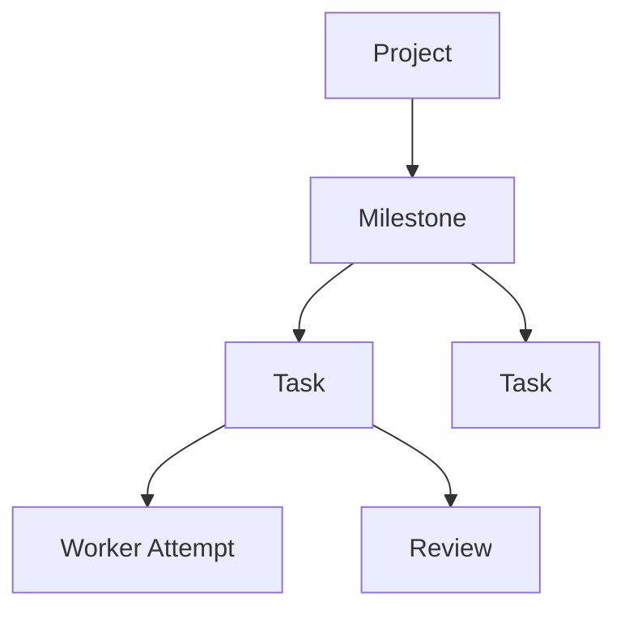
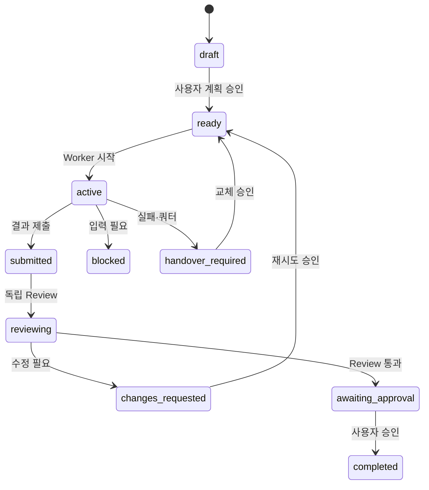

# Herdr Agent/Skills Harness Architecture

## 1. 목적

Herdr에서 Claude, Codex, AGY를 함께 사용하되 프로젝트마다 Controller 프로그램을 개발하지 않고 역할 문서, Agent Skills, Git, 사용자 승인으로 전체 작업 흐름을 운영합니다.

이 문서에서 Full Harness는 다음 흐름을 모두 다룬다는 의미입니다.

```text
Interview → SPEC → Reference → Plan → Work → Verify → Review → User Approval → Handover
```

무인 실행, 트랜잭션, 물리적 Sandbox를 의미하지는 않습니다.

핵심 실행 원칙은 "Bash는 한 스텝, Agent가 루프"입니다. `harness.sh`는 호출 한 번에 검증, 상태 전이 또는 Agent 한 턴만 수행합니다. Orchestrator Agent가 그 결과와 사용자 응답을 해석해 다음 명령을 선택하며, 상주 루프·자동 failover·자동 완료 승인은 수행하지 않습니다.

## 2. 구성요소

| 구성요소 | 책임 |
|---|---|
| Herdr | Workspace, Pane, Agent 프로세스와 상태 표시 |
| `harness.sh` 스텝 명령 | 정적 검증, 상태 전이 강제, Agent 한 턴 실행, Evidence와 런타임 관측 |
| `AGENTS.md` | Provider 공통 운영 정책 |
| `CLAUDE.md`, `GEMINI.md` | Provider별 짧은 진입 지침 |
| `.agents/roles/` | 역할·책임·금지사항 정본 |
| `.agents/skills/` | 재사용 가능한 실행 절차 |
| `.claude/skills/` | Claude가 공통 Skill을 읽기 위한 연결 |
| `.harness/` | SPEC, Wave, Task, Attempt, Evidence, Review, Handover, Decision, Runtime 상태 |
| 사용자 | SPEC, Wave, Failover, Integration, 완료 승인 |

## 3. 역할

| 역할 | 쓰기 | 책임 |
|---|---:|---|
| Interviewer | Harness 문서 | 요구사항과 기존 자료 확인 |
| Planner | Harness 문서 | Milestone과 Task 분할 |
| Orchestrator | Harness 상태 | Herdr Pane과 Wave 운영 |
| Primary Worker | Task 범위 | 구현·조사·분석 |
| Advisor | 없음 | 특정 쟁점의 읽기 전용 조언 |
| Reviewer | 없음 | 전체 품질과 Evidence 검토 |
| 사용자 | 승인 | 최종 상태와 Provider 교체 결정 |

하나의 Task에 여러 Provider가 참여할 수 있지만 동시에 쓰기 가능한 Primary Worker는 한 명뿐입니다.

## 4. Project, Milestone, Task



- Project는 전체 최종 목표입니다.
- Milestone은 Project 완성에 필요한 중간 목표입니다.
- Task는 Milestone을 만드는 하나의 검증 가능한 목적입니다.
- 프로젝트 전체 Task 수는 제한하지 않습니다.
- 현재 활성 Task는 기본 5개, 병렬 Worker는 2개로 제한합니다.
- 완료 Milestone은 Archive해 기본 Context에서 제외합니다.

## 5. Task 상태



Worker는 `completed`를 선언하지 않습니다. Reviewer는 품질 판정을 기록하고 사용자가 완료를 승인합니다.

상태 변경은 `herdr-harness transition PATH TASK_ID TO_STATE`만 사용합니다. `submitted`에는 Attempt와 Evidence, `awaiting_approval`에는 `판정: APPROVED`인 Review, `completed`에는 `.harness/decisions/TASK-approval.md`의 `승인: yes`가 필요합니다.

## 6. Skills

| Skill | 역할 |
|---|---|
| `harness-interview` | 요구사항 인터뷰 |
| `harness-reference` | 기존 코드·데이터·문서 Inventory |
| `harness-plan` | Milestone과 Task 분할 |
| `harness-orchestrate` | Herdr 실행과 상태 관리 |
| `harness-work` | Task 단위 구현·분석 |
| `harness-verify` | 검증과 Evidence 기록 |
| `harness-review` | 독립 품질 Review |
| `harness-handover` | 실패·쿼터 시 Context 인계 |
| `harness-status` | 현재 진행 상황 요약 |

각 Skill은 현재 역할 문서, SPEC, STATE, Task Contract를 명시적으로 읽습니다. Skill은 운영 규칙이며 파일 접근을 물리적으로 차단하지 않습니다.

## 7. 실행 흐름

1. `init`이 프로젝트 파일과 Git 저장소를 만들고 가능한 경우 기준 commit을 생성합니다.
2. Interview와 Plan 후 사용자가 SPEC과 Wave를 승인합니다.
3. Orchestrator가 `validate [PATH] --wave ID`로 실행 전제를 검사합니다.
4. `transition ... active` 후 `dispatch ... worker`로 Worker 한 턴만 실행합니다.
5. `blocked`, `timeout`, `stalled`이면 `observe`로 상태를 재조회하고 Orchestrator가 사용자 질문, 대기 또는 중단을 결정합니다.
6. Attempt와 Evidence가 준비되면 `transition ... submitted`, 이어서 `transition ... reviewing`을 수행합니다.
7. `dispatch ... reviewer`로 다른 Provider의 읽기 전용 Review 한 턴을 실행합니다.
8. Review 판정에 따라 `changes_requested` 또는 `awaiting_approval`로 전이합니다.
9. 사용자가 승인 파일에 `승인: yes`를 기록한 뒤에만 `completed`로 전이합니다.
10. 등록된 Agent는 `close-agent`, 전체 상태는 `status --live`로 정리·관측합니다.

## 8. 실패와 쿼터

Provider 교체는 실패가 확인된 경우에만 수행합니다.

- Rate Limit 또는 Quota 오류
- Agent 프로세스 종료
- 반복 검증 실패
- 사용자의 명시적 교체 지시

교체 순서:

```text
실패 확인 → Handover → Git Diff 확인 → 사용자 승인 → Fallback Attempt
```

정상 실행 중 비교 목적으로 모든 Provider를 동시에 호출하지 않습니다.

## 9. Context Packet

`dispatch`는 Worker와 Reviewer에게 전체 대화 대신 `.harness/runtime/TASK-context-ROLE.md` Context Packet을 한 번 전달합니다.

- 승인된 SPEC 관련 부분
- 현재 Task Contract
- write scope, 참조와 입력
- Acceptance Criteria와 검증 방법
- 다음 한 단계

Secret 의심 패턴이 발견되면 Context 원문을 저장·전송하지 않고 해당 dispatch를 실패시킵니다.

## 10. 병렬 실행

다음 조건을 모두 만족하는 Task만 병렬 실행합니다.

- 의존성이 없음
- 수정 경로가 겹치지 않음
- 같은 Schema, Migration, Lockfile을 수정하지 않음
- 같은 외부 자원에 쓰지 않음
- Task마다 Primary Worker가 한 명

공유 Resource가 있으면 순차 실행합니다. Merge나 Rebase 후에는 관련 검증을 다시 실행합니다.

## 11. 도메인 Profile

### Python 시계열

- 기존 Notebook, 코드, 데이터, 실험 결과를 먼저 확인
- 시간 순서 Split과 데이터 누수 검토
- Baseline, Backtesting, 재현성, 불확실성 검증

### 네트워크 장비·SNMP

- 사용자 제공 Dump, MIB, 벤더 문서, 기존 Receiver 설정 확인
- Canonical Schema와 Vendor Adapter 분리
- Counter Reset, 단위, Timestamp, Unknown OID 검증
- 실제 Dump 기반 회귀 테스트

테스트 하나마다 Agent를 배정하지 않습니다. Adapter, Fixture, 테스트, 관련 문서를 하나의 목적 중심 Task에 함께 포함할 수 있습니다.

## 12. 보안과 신뢰 경계

- `write_scope`와 Skill은 운영 지침이지 Sandbox가 아닙니다.
- Secret을 Prompt, Evidence, Pane 기록에 넣지 않습니다.
- 배포, 삭제, 외부 쓰기는 사용자 승인을 받습니다.
- Worker의 자체 테스트만으로 완료하지 않습니다.
- 가능하면 외부 CI 결과를 최종 Evidence로 사용합니다.

## 13. 향후 고도화

현재 Harness는 이미 YAML/상태 검증, Evidence 기록, Secret 패턴 차단, 경로 충돌 검사와 Herdr Pane·Agent 스텝 실행을 제공합니다. 다음 기능은 실제 필요가 확인될 때만 별도 고도화합니다.

### 선택적 고도화

- Event Log와 Replay
- SQLite Lease와 Controller Epoch
- Fencing Token
- Atomic Outbox
- Worktree와 Integration Lock
- Sealed Verification Bundle
- 자동 Failover
- Container 또는 별도 OS 사용자 격리

상주 Controller와 자동 Failover는 현재 Harness의 범위가 아닙니다.
